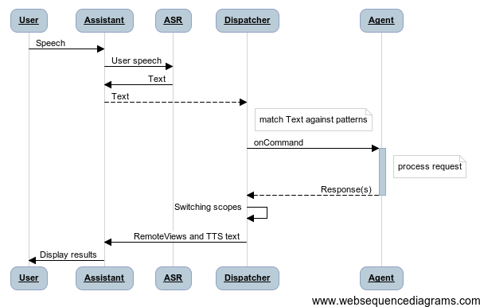

# Agents

An Agent is the entry point for your app. From the implementation point of view, it is a special add-in to an [Android service](http://developer.android.com/guide/components/services.html). Due to the fact that *Everyday Assistant* uses the interprocess communication, your app functions become accessible to the assistant user by means of calling special agent methods.

> An agent is a bit more than just a service. It is a special wrapper, which implements the methods of interaction with the user via the assistant. Agents can generate the UI, process its events, mange the dialog context, launch external activities to get response from them and feature many other useful functions.

## Agent registration

Agents are registered in your app's `AndroidManifest.xml` manifest file as a service:

	<service android:name=".MyAgent">
	
            <intent-filter>
                <action android:name="mobi.voiceassistant.intent.action.COMMAND"/>
                <data android:scheme="assist" android:host="mobi.voiceassistant.en"/>
            </intent-filter>
            
            <meta-data android:name="mobi.voiceassistant.MODULE"
                       android:resource="@xml/mod_example"/>
                       
	</service>

As for the filter, you have to indicate that the service must accept the `mobi.voiceassistant.intent.action.COMMAND` action. This means that the agent will respond to user commands.

It is also necessary to indicate the particular *Everyday Assistant* app that your agent is going to use. To do this, please indicate the name of assistant pack in the `android:host` attribute of the filter `data` tag.

> The fact is that *Everyday Assistant* may have a number of different builds, e.g., for various languages, thus having various packages.
>
> If your agent is able to work with several builds (e.g., it is available for several languages), you can specify several `data` tags in the agent filter.

`mobi.voiceassistant.MODULE` metadata specifies the main [module](grammarsyntax.html) used by your agent. While initializing the agent, *Everyday Assistant* will load all commands belonging to this module and link them to the agent.

## Agent lifecycle

Agent lifecycle is the same as the lifecycle of `Dispatcher`, the main *Everyday Assistant* service.

## Interaction with the user

It is the assistant app who interacts with the user and decides, which agent should be used to process every specific request.

The assistant dispatches the user request to the agent by calling the required feedback methods and sending necessary data using these methods.

The agent must formulate a response to every request in some format (either UI, or plain text, or articulation text, etc.); it may also change the current dialog context (activate the necessary modules or switch the dialog to modal mode). For more information about context management, please see [Scopes](scopes.html) section.

> Similarly to *HTTP* protocol, the agent acts a server for the browser (assistant). The only difference is that the agent can send several responses to every user request; these responses will be displayed as alternatives.
>
> This similarity is the source of `Request` and `Response` names in the API. There is also the `Cookies` abstraction, used for storing temporary data between agent calls.

In a general way, the interaction between the agent, the assistant and the user can be conceived of as a 

## Agent implementation

Every agent must implement the methods of [`AssistantAgent`](http://voiceassistant.mobi/reference/mobi/voiceassistant/client/AssistantAgent.html) abstract class, which suggests the redefinition of at least one method, [`onCommand`](http://voiceassistant.mobi/reference/mobi/voiceassistant/base/Agent.html#onCommand(mobi.voiceassistant.base.Request)).

### onCommand

This method is the assistant's single entry point to your app. The assistant calls it every time the user interacts with your agent (using either speech or UI).

The method is executed in the main flow and accepts an instance of [`Request`](http://voiceassistant.mobi/reference/mobi/voiceassistant/base/Request.html) class as an argument; this instance must contain all data required for command execution.

> Normally the implementation of this method consists in delegating the call to one of the agent's methods corresponding to the command ID (`dispatchId`).

### Request

User request contains command ID, session information, set of cookies and the content itself.

The content may be represented by a [token](token.html) (in case of voice interaction with the user) or by any other [Parcelable](http://developer.android.com/reference/android/os/Parcelable.html) object (in case of non-voice interaction, e.g. when the user taps a button in the UI).

Request also contains the `Uri`, the ID of an element in the dialog history, to which the agent's answer(s) will be linked.

Using [`createResponse`](http://voiceassistant.mobi/reference/mobi/voiceassistant/base/Request.html#createResponse()) method, we can generate a response, which must be later filled with data. Every response must be added to the request using the [`addResponse`](http://voiceassistant.mobi/reference/mobi/voiceassistant/base/Request.html#addResponse(mobi.voiceassistant.base.Response)) method.

> `Request` class includes many auxiliary methods that allow to generate a one-string  response quickly, to change the previous response, to delete it, or perform other similar operations. For more information, please see the [`Request`](http://voiceassistant.mobi/reference/mobi/voiceassistant/base/Request.html) class documentation.

### Response

The user sees the response from your app as [bubbles](bubbles.html), that appear on the screen during the conversation. Bubbles can consist in plain text or some more complex UI.

> Their implementation is based on [RemoteViews](http://developer.android.com/reference/android/widget/RemoteViews.html), as this is the only UI presentation that can be used by a third-party process under Android. Therefore you must take into account all restrictions on the UI implementation imposed by this approach.

Apart from displayed data, the response may contain a text for voice synthesis, a set of cookies, as well as the information about the dialog context, in which the next user request should be processed (for detailed information, please see [Scopes](scopes.html) section). Thus, the response is also used to manage the dialog. For more information, please see [`Response`](http://voiceassistant.mobi/reference/mobi/voiceassistant/base/Response.html) class docs.

> We would like to underline this new parallel with web programming, where the presentation level is separated from logic and management level. In case of the assistant, the [modules](grammarsyntax.html) offer a declarative description of user speech processing, while the agents (being the imperative part) give a description of data processing and dialog management.
>
> This approach allows you to separate dialog aspects from domain logic, thus providing the developer with a relatively simple and understandable way of incorporating the speech interface into his own app.

### Cookies

Just as in web technologies, the assistant can store small bits of required data between two calls of your agent in form of cookies. E.g., in case of dialogs where the app gets some data from the user step by step, it is necessary to store the data received from previous answers. In case of context questions processing the app might need to store some short-time state (e.g., the request *"What's the weather in New York now"* might followed by *"Next week"* phrase).

> The agent can also store necessary data for a longer time; in this case you should use other Android instruments, such as databases or `SharedPreferences` (for more information, please see the [data storage docs](http://developer.android.com/guide/topics/data/data-storage.html))

In order to store cookies you should use [`putCookie`](http://voiceassistant.mobi/reference/mobi/voiceassistant/base/Response.html#putCookie(int, java.lang.String, double)) methods that accept the visibility area for the stored cookie (`mode`), cookie's name and value.

> Cookie visibility area defines the agent that can access the cookie by request. In this way you can organize the interaction between various agents. E.g., every request contains a `Location` cookie, accessible to all agents, which contains the last known user location.
>
> [`COOKIE_MODE_AGENT`](http://voiceassistant.mobi/reference/mobi/voiceassistant/base/Response.html#COOKIE_MODE_AGENT) - cookie accessible to current agent only
>
> [`COOKIE_MODE_PACKAGE`](http://voiceassistant.mobi/reference/mobi/voiceassistant/base/Response.html#COOKIE_MODE_PACKAGE) - cookie accessible to any agent from the package
>
> [`COOKIE_MODE_GLOBAL`](http://voiceassistant.mobi/reference/mobi/voiceassistant/base/Response.html#COOKIE_MODE_GLOBAL) - cookie accessible to any agent, incl. agents from other packages