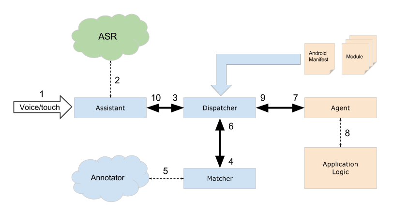
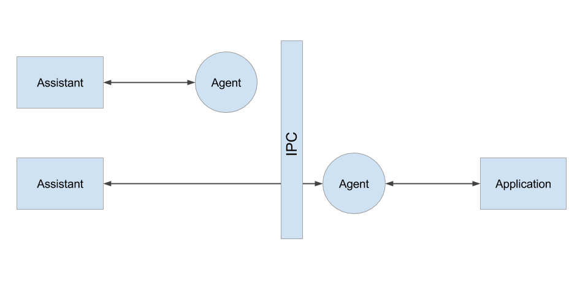

# *Everyday Assistant* API Architecture

*"Everyday Assistant"* is a standard Android app ensuring user interaction using both voice and graphic interface (GUI). The assistant contains a number of own (built-in) services, which were created using this same API. API offers you an opportunity to implement your own services that can be called plugins.

## What is a service

Every service is a set of [agents](agents.html), [modules](grammarsyntax.html) and a certain domain logic. Agents are an add-in to [Android services](http://developer.android.com/guide/components/services.html), while the interaction between the assistant and the agent is ensured by the interprocess communication (IPC).

## Assistant functions

*"Everyday Assistant"* itself consists of the GUI and the core, whose functions include dispatching user request to the required agent and acquiring of results from the agent in order to display them to the user, as well as switching the dialog context. The component in charge of these operations (independently from the GUI) is called `Dispatcher`.

> Thus the assistant features a fully modular structure, where the presentation level (GUI), dialog management logic (Dispatcher) and the services ([Agents](agents.html)) are separated.

## Speech recognition and NLP

The assistant interacts with the speech recognition system (ASR), which enables him to convert user speech into a string. This string is then processed by a special core component, called *Matcher*. The matcher implements the NLP (natural language processing) function using the data from the [modules](grammarsyntax.html) that describe user voice request [patterns](patternsyntax.html). The matcher outputs a decision which defines the command to be executed in the current [scope](scopes.html) and the command parameters ([text parsing tree](token.html)).

*Scopes are sets of modules currently available to the user. These sets make the dialog context.*

> *Everyday Assistant* uses third-party ASR solutions and doesn't depend on any particular implementation of this technology.

### Hybrid NLP

"Everyday Assistant" matcher implements a hybrid NLP, which uses data from various sources for matching the text against patterns. In other words, before processing the text, the matcher can get the data from local databases or send the string to remote servers where large text volumes are stored. These servers complete the text information (*annotate* it) and return the information to the local matcher for processing. Thus it is possible to store some data (such as lists of world cities etc.) on the servers, while some data are stored locally (e.g., contact list or app list).

Therefore you can build the patterns in a number of ways, which lets you implement voice communication with the user as complex need be:

- Describe patterns statically in the [module](modules.html)
-Use [content providers](contentproviders.html) to generate pattern entities dynamically (also for data acquisition from remote devices or local databases)
- Store big entity lists on the servers featuring a special annotating utility and indicate the source in the pattern (`uri` attribute)

> For more information about annotating the text on remote servers, see [Content providers](contentproviders.html) section.

This enables you to scale your app in such a way that you won't be reliant on the ways of data storage. At the same time, you don't need to describe all possible entities and can confine yourself to those that are really required for the implementation of the app logic.

## Interaction with the agent

As stated before, the assistant core interacts with an [agent](agents.html) using IPC. In fact, the agent serves as a program interface between the assistant and the domain logic of the app. Every agent is described in the app manifest (`AndroidManifest.xml`); the assistant loads its main module every time at "cold" start or dynamically, while installing the app.

Then at every user request to the agent the assistant calls the `AssistantAgent` abstract class methods, which must be implemented by a particular agent. The assistant logs user requests and connects the agent answer(s) to a particular history item.

Every answer received from the agent contains some content displayed in the assistant GUI and (optionally) a dialog management instruction (for more information, see [Scopes](scopes.html) section).

> For more information about content types generated by the agent, see [bubbles](bubbles.html) section.

## Scheme of interaction between the user and the agents

*Components marked in blue are implemented in the Assistant. Components marked in rose should be implemented in the app being developed. Third-party components are marked in green*

Generally speaking, after the assistant has successfully loaded your app modules, the scheme of interaction between the user and the agents is as follows:

1. The user interacts with "Everyday Assistant" either using his voice (that is, by activating the microphone and saying something), or using the touch screen (tapping on the buttons selecting list items, etc.).
2. The assistant processes user input and when necessary interacts with the speech recognition system (ASR) in order to convert speech into a text string.
3. Then the assistant sends a Request to the Dispatcher, who manages all interactions with the matcher and the agents.
4. The dispatcher stores the information concerning the [context](scopes.html) at any specific time. After receiving a request from the Assistant, it calls the Matcher within the active scope by sending it the text string. *If the user request represents an interaction with the GUI (PendingRequest) instead of speech, then the Matcher stage is omitted and the Dispatcher sends the already shaped request directly to the Agent (see step 7).*
5. When a network connection is available, the Matcher first sends the string to remote servers, which should add supplementary information to the text, and then matches the text against the patterns from the defined module scope.
6. Matcher's output is the information about the command to be executed and the agent to which the command belongs. Moreover, the Matcher returns to the Dispatcher a [token](token.html), i.e., the semantic tree of phrase parsing according to command pattern.
7. The Dispatcher sends the request to a particular app agent, while at the same time expanding [automatic scopes](scopes.html). Agent methods are called via IPC.
8. While processing the call of one of `AssistantAgent` methods, the agent interacts with the app logic. The implementation of this interaction has no restrictions and depends solely on the app developer.
9. The agent must return at least one Response to every Dispatcher request. Such Response must contain the [response context](bubbles.html) and the information about scope change, when necessary. *If the execution of the app logic takes much time due to network interactions etc., the Agent might return an answer to the Dispatcher, then go to background (`goBackground`) and refresh the already sent response later.*
10. After receiving the response(s) from the Agent, the Dispatcher refreshes the scope status and sends the necessary data to the Assistant who will display them via the GUI and articulate via the .

## Types of interaction between the agent and the assistant

There are several ways to implement the interactions between the agent and the assistant core.

### Built-in agent

This type of agent implementation is used for "Everyday Assistant" own services or the services of any app that is based on the assistant core. It isn't described in this document).

### Third-party agent

This type is used for the implementation of the interactions between your (third-party) app with the assistant. The agent is implemented on your app's side and provides an interface. Such agent can display the necessary GUI inside the assistant using [bubbles](bubbles.html).

> Please note that your app doesn't need to have its *own* touch GUI, or a launcher icon, etc. In this case, it will look as an assistant plug-in.

